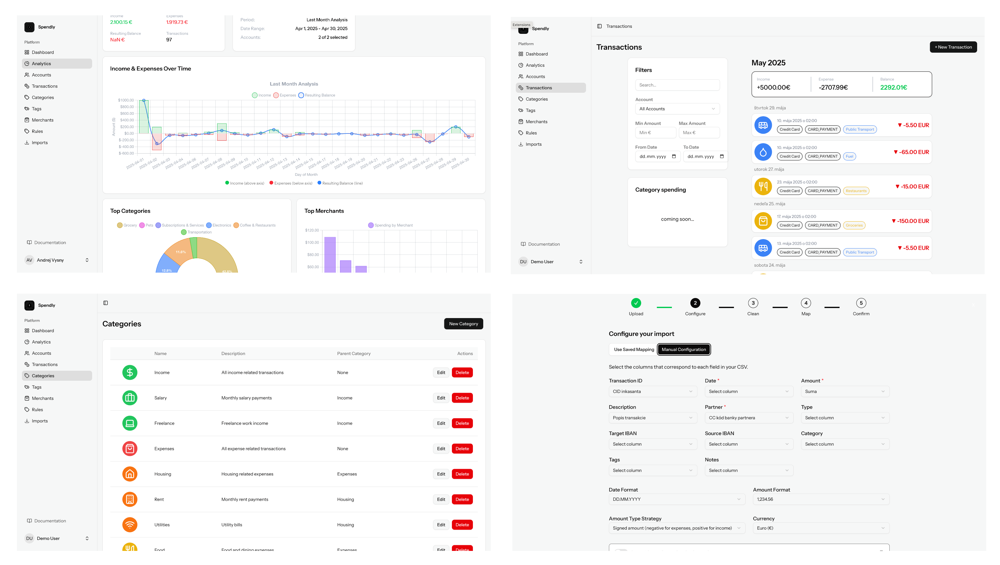

# Spendly - Personal Finance Tracker

**Based on [laravel/react-starter-kit](https://github.com/laravel/react-starter-kit)**

<!--
SPDX-License-Identifier: GPL-3.0-or-later
SPDX-FileCopyrightText: 2024 Spendly Contributors
-->

[](https://www.gnu.org/licenses/gpl-3.0)
[](https://spdx.org/licenses/GPL-3.0-or-later.html)
[](https://laravel.com)
[](https://reactjs.org)
[](docs/SECURITY.md)
[](docs/DEPLOYMENT.md)

> ⚠️ **Development Status Notice**
> 
> This project is currently in active development with no official release yet. The codebase and documentation have been significantly developed using AI assistance and require extensive refactoring and thorough code review before being production-ready. Use at your own risk and contributions are welcome to help improve the code quality and stability.

Spendly is an open-source personal finance tracker that helps you manage your finances, analyze spending patterns, and maintain budgets. It integrates with GoCardless for seamless bank account imports and provides powerful financial analysis tools.

## 📸 Screenshots



## 🌟 Features

- **Bank Account Integration**: Import transactions automatically using GoCardless
- **Financial Analysis**: Get insights into your spending patterns and financial health
- **Budget Management WIP**: Create and track budgets for different categories
- **Transaction Categorization WIP**: Automatically categorize transactions with machine learning - currently supports manual categorization
- **Reports & Visualizations**: Beautiful charts and reports for better financial understanding
- **Multi-currency Support WIP**: Track finances in multiple currencies
- **CSV Import**: Import transactions from CSV files with customizable field mapping
- **Self-Hosting**: Easy deployment with Docker, Kubernetes, or bare metal
- **API Access WIP**: RESTful API for integrations and automation

## 🚀 Tech Stack

- **Backend**: Laravel 10.x
- **Frontend**: React 18.x with TypeScript
- **Database**: SQLite (default), MySQL, PostgreSQL
- **Authentication**: Laravel Sanctum
- **API Integration**: GoCardless API (WIP)
- **Testing**: PHPUnit, Jest
- **Deployment**: Docker

## 🐳 Quick Start

### Docker (Recommended)

1. Make sure you have Docker installed on your system.

2. Run the application:

```bash
docker run -p 80:80 ghcr.io/andrejvysny/spendly:main
```

3. Visit `http://localhost` in your browser.

### Docker Compose

```bash
# Download docker-compose file
curl -o compose.prod.yml https://raw.githubusercontent.com/andrejvysny/spendly/main/compose.prod.yml

# Create environment file
cat > .env << 'EOF'
APP_KEY=base64:$(openssl rand -base64 32)
MAIL_HOST=your-smtp-host
MAIL_PORT=587
MAIL_USERNAME=your-email@example.com
MAIL_PASSWORD=your-password
MAIL_FROM_ADDRESS=your-email@example.com
EOF

# Start Spendly
docker compose -f compose.prod.yml up -d
```

## 📚 Documentation (WIP)
 
- **[Installation Guide](docs/INSTALLATION.md)** - Detailed setup instructions
- **[Deployment Guide](docs/DEPLOYMENT.md)** - Self-hosting and production deployment
- **[Development Setup](docs/DEVELOPMENT.md)** - Local development environment
- **[API Documentation](docs/API.md)** - RESTful API reference
- **[Contributing Guidelines](CONTRIBUTING.md)** - How to contribute
- **[Security Policy](SECURITY.md)** - Security and vulnerability reporting

## 🔧 Development

See [Development Guide](docs/DEVELOPMENT.md) for detailed instructions.

## 🔒 Security

Spendly takes security seriously, especially when handling financial data:

- **Regular security audits** and dependency updates
- **Secure authentication** with Laravel Sanctum
- **Input validation** and SQL injection prevention
- **Security headers** and CSRF protection

Report security vulnerabilities to **vysnyandrej@gmail.com**. See [SECURITY.md](SECURITY.md) for details.

## 🤝 Contributing

We welcome contributions! Please see our [Contributing Guidelines](CONTRIBUTING.md) for details on:

- Code of Conduct
- Development setup
- Submitting pull requests
- Reporting issues
- Financial domain best practices

## 📄 License

This project is licensed under the GNU General Public License v3.0 (GPLv3). See LICENSE for details.

## 🏛️ Governance

- **Code of Conduct**: [CODE_OF_CONDUCT.md](CODE_OF_CONDUCT.md)
- **Security Policy**: [SECURITY.md](SECURITY.md)
- **Contributing Guidelines**: [CONTRIBUTING.md](CONTRIBUTING.md)
- **Changelog**: [CHANGELOG.md](CHANGELOG.md)

## 🙏 Acknowledgments

- [Laravel](https://laravel.com) - The PHP framework for web artisans
- [React](https://reactjs.org) - A JavaScript library for building user interfaces
- [GoCardless](https://gocardless.com) - Bank account data API
- [Tailwind CSS](https://tailwindcss.com) - A utility-first CSS framework
- All our contributors and supporters

## 📞 Support

- **Documentation**: [Installation](docs/INSTALLATION.md) | [API](docs/API.md) | [Deployment](docs/DEPLOYMENT.md)
- **GitHub Issues**: [Report bugs or request features](https://github.com/andrejvysny/spendly/issues)
- **Security Issues**: vysnyandrej@gmail.com
- **Community**: [GitHub Discussions](https://github.com/andrejvysny/spendly/discussions)

## 🔗 Links

- **Project Repository**: [GitHub](https://github.com/andrejvysny/spendly)
- **Docker Images**: [GitHub Container Registry](https://ghcr.io/andrejvysny/spendly)
- **Issue Tracker**: [GitHub Issues](https://github.com/andrejvysny/spendly/issues)
- **API Documentation**: [docs/API.md](docs/API.md)

---

**Made with ❤️ for the open-source community**
