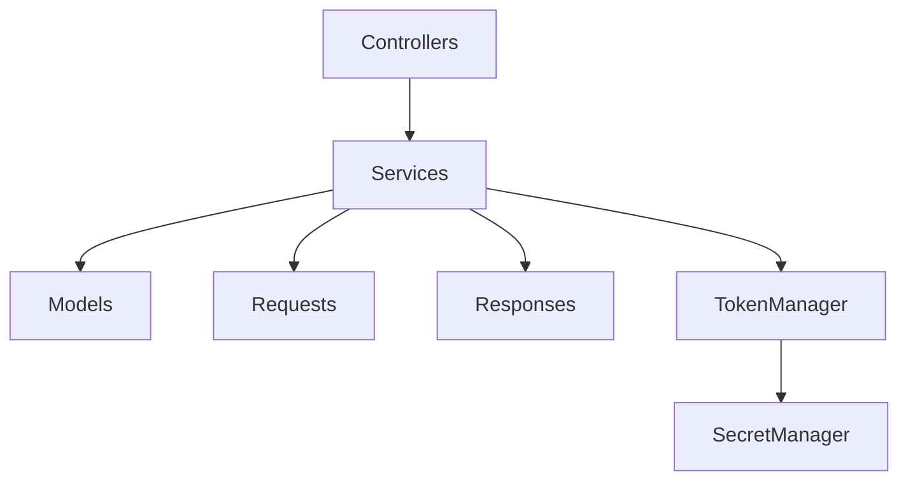

# GoCardless (Nordigen) Integration Architecture

## 1. Overall Architecture

The GoCardless integration follows a layered architecture pattern with clear separation of concerns:



### Key Components:
- **Controllers**: Handle HTTP requests and coordinate the flow
- **Services**: Implement business logic and coordinate data operations
- **Models**: Represent data structures and business entities
- **Requests**: Handle API communication with GoCardless
- **Responses**: Parse and validate API responses
- **TokenManager**: Manages authentication and token lifecycle
- **SecretManager**: Handles secure credential storage

## 2. Component Responsibilities

### Controllers

#### SelectionController
- Handles bank selection flow
- Routes:
  - `GET /selection`: Display bank selection form
  - `POST /selection`: Process bank selection
- Responsibilities:
  - Validates user input
  - Manages configuration state
  - Coordinates with TokenManager for authentication
  - Handles bank listing and selection

#### LinkController
- Manages bank account linking process
- Routes:
  - `GET /build`: Create requisition and redirect to bank
  - `GET /callback`: Handle bank callback
- Responsibilities:
  - Creates user agreements
  - Manages requisitions
  - Handles OAuth flow
  - Stores account references

### Services

#### TokenManager
- Manages authentication lifecycle
- Key methods:
  - `getAccessToken()`: Retrieves valid access token
  - `validateAllTokens()`: Validates and refreshes tokens
  - `getNewTokenSet()`: Obtains new token set
- Handles token refresh and validation

#### SecretManager
- Manages secure credential storage
- Handles encryption/decryption of sensitive data
- Provides credential retrieval interface

### Models

#### Account
- Represents bank account information
- Key fields:
  - `identifier`: Unique account identifier
  - `iban`: International Bank Account Number
  - `currency`: Account currency
  - `balances`: Array of account balances
  - `status`: Account status
  - `name`: Account name
  - `ownerName`: Account owner name

#### Transaction
- Represents bank transaction data
- Key fields:
  - `transactionId`: Unique transaction identifier
  - `bookingDate`: Transaction booking date
  - `valueDate`: Transaction value date
  - `transactionAmount`: Transaction amount
  - `currencyCode`: Transaction currency
  - `creditorName`: Creditor name
  - `debtorName`: Debtor name
  - `remittanceInformation`: Transaction description

#### Balance
- Represents account balance information
- Key fields:
  - `balanceAmount`: Current balance amount
  - `currency`: Balance currency
  - `balanceType`: Type of balance (e.g., "closingBooked")
  - `lastChangeDateTime`: Last balance change timestamp

## 3. Data Flow

1. **Authentication Flow**:
   ```
   Client -> SelectionController -> TokenManager -> GoCardless API
   ```

2. **Bank Selection Flow**:
   ```
   Client -> SelectionController -> ListBanksRequest -> GoCardless API
   ```

3. **Account Linking Flow**:
   ```
   Client -> LinkController -> PostNewUserAgreement -> PostNewRequisitionRequest -> GoCardless API
   ```

4. **Transaction Import Flow**:
   ```
   Client -> ImportController -> GetAccountTransactionsRequest -> GoCardless API
   ```

## 4. Error Handling

The integration uses a robust error handling system:

1. **Custom Exceptions**:
   - `ImporterErrorException`: General import errors
   - `ImporterHttpException`: HTTP-related errors
   - `ImporterJsonException`: JSON parsing errors

2. **Error Response Handling**:
   - All API responses are wrapped in `ErrorResponse` objects
   - Detailed error messages and codes are preserved
   - Errors are logged with appropriate context

3. **Validation**:
   - Input validation at controller level
   - Response validation at service level
   - Model-level validation for data integrity

## 5. Configuration

The integration uses several configuration files:

1. **nordigen.php**:
   - API endpoints
   - Country configurations
   - Sandbox settings
   - Timeout settings

2. **Environment Variables**:
   - `NORDIGEN_ID`: API client ID
   - `NORDIGEN_KEY`: API client secret
   - `NORDIGEN_URL`: API base URL

## 6. Security Considerations

1. **Token Management**:
   - Access tokens are stored in session
   - Refresh tokens are securely managed
   - Token validation before each request

2. **Credential Storage**:
   - API credentials are encrypted
   - Secure credential retrieval
   - No hardcoded credentials

3. **Data Protection**:
   - Sensitive data is encrypted
   - Secure session management
   - Input sanitization

## 7. Extension Points

1. **Custom Bank Integration**:
   - Add new bank configurations in `nordigen.php`
   - Implement bank-specific adapters if needed

2. **Transaction Processing**:
   - Extend `Transaction` model for custom fields
   - Implement custom transaction processors

3. **Error Handling**:
   - Add custom exception handlers
   - Implement custom error responses

## 8. Usage Examples

### Bank Selection
```php
// Controller
$controller = new SelectionController();
$response = $controller->index();

// Service
$tokenManager = new TokenManager();
$accessToken = $tokenManager->getAccessToken();
$request = new ListBanksRequest($url, $accessToken);
$banks = $request->get();
```

### Account Linking
```php
// Controller
$controller = new LinkController();
$response = $controller->build();

// Service
$agreementRequest = new PostNewUserAgreement($url, $accessToken);
$agreementRequest->setBank($bankId);
$agreement = $agreementRequest->post();

$requisitionRequest = new PostNewRequisitionRequest($url, $accessToken);
$requisitionRequest->setBank($bankId);
$requisitionRequest->setAgreement($agreement->id);
$requisition = $requisitionRequest->post();
```

### Transaction Import
```php
// Controller
$controller = new ImportController();
$response = $controller->download();

// Service
$request = new GetAccountTransactionsRequest($url, $accessToken);
$request->setAccount($accountId);
$transactions = $request->get();
``` 